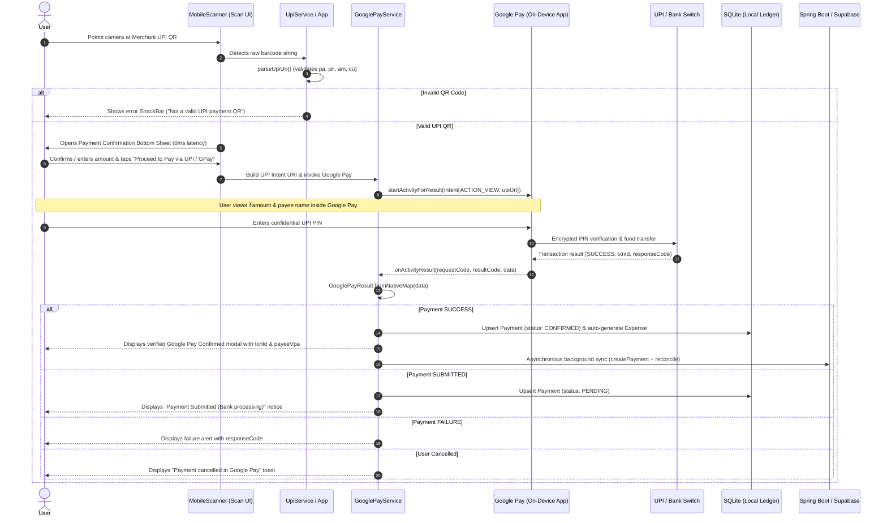

# Huly.pay — Google Pay & UPI QR Payment Workflow

This document provides a comprehensive end-to-end technical explanation of how **Google Pay (GPay) and UPI QR code payments** operate within the Huly.pay mobile and backend ecosystem.

---

## 1. Architectural Overview & Design Philosophy

```
  Huly.Pay Flutter App
          │
          │ 1. Create UPI Intent (upi://pay?pa=...&am=10...)
          ▼
     Google Pay App
          │
          │ 2. User sees ₹10
          │ 3. User enters UPI PIN
          ▼
      UPI / Bank
          │
          │ 4. Payment processed
          ▼
     Google Pay App
          │
          │ 5. Google Pay returns payment result (onActivityResult)
          ▼
  Huly.Pay Flutter App
    - Processes UPI intent response directly
    - Status: SUCCESS / SUBMITTED / FAILURE
    - Extracts: txnId, txnRef, toVpa, amount, responseCode
    - Updates local SQLite ledger instantly (0ms)
    - Syncs to Spring Boot / Supabase in background
```

### Direct App-to-App Invocation (Zero Server Mediation)
Google's official India UPI documentation specifies that payment intent execution occurs **directly between the calling application and the installed Google Pay app**:
1. **It is NOT**:
   ```
   Flutter App -> Google Pay -> Google Pay Server -> Backend Server -> Flutter App
   ```
2. **It IS**:
   ```
   Huly.Pay Flutter App -> Google Pay App on Android -> Bank / UPI Switch -> Google Pay App -> Huly.Pay Flutter App
   ```
3. **App-Centric UPI Response Processing**:
   When payment completes, Android returns control directly to Huly.Pay's Activity via `onActivityResult`. The response bundle and `tezResponse` JSON contain:
   - `Status`: `SUCCESS`, `SUBMITTED`, or `FAILURE`
   - `txnId`: Transaction identifier
   - `txnRef`: Merchant reference
   - `toVpa` / `pa`: Payee VPA
   - `amount`: Verified payment amount
   - `responseCode`: NPCI response code (`00` for success)

The Flutter application itself processes this UPI Intent response directly on the client, updating its local SQLite ledger with zero latency, and dispatching synchronization to the backend asynchronously.

---

## 2. End-to-End Payment Flow (Step-by-Step)



---

## 3. Deep Dive into the Implementation Components

### Phase 1: Camera Scanner & QR Detection
- **File**: `mobile/lib/screens/scan_and_pay_screen.dart`
- **Component**: `MobileScanner` controller running at 60 FPS.
- When a frame detects a 2D barcode, `_handleBarcodeDetected(BarcodeCapture capture)` intercepts the raw payload.

```dart
void _handleBarcodeDetected(BarcodeCapture capture) {
  if (_isProcessing) return;
  final barcode = capture.barcodes.firstOrNull;
  if (barcode == null || barcode.rawValue == null) return;
  final rawValue = barcode.rawValue!.trim();
  if (rawValue.isEmpty) return;

  final upiData = UpiService.parseUpiUri(rawValue);
  if (upiData != null) {
    _processPaymentFlow(upiData);
  } else {
    _handleInvalidBarcodeDetected();
  }
}
```

---

### Phase 2: NPCI UPI URI Parsing & Strict Validation
- **File**: `mobile/lib/services/upi_service.dart`
- **Class**: `UpiService` and `UpiPaymentData`

Standard UPI QR codes encode a URI with the following parameters:
- `pa` (*Payee Address*): The recipient UPI ID / VPA (e.g. `merchant@okaxis`, `coffeehouse@upi`). **Mandatory**.
- `pn` (*Payee Name*): Registered merchant or personal display name.
- `am` (*Amount*): Preset transaction amount (if dynamic billing QR).
- `cu` (*Currency*): Defaults to `INR`.
- `tr` (*Transaction Reference*): Merchant reference ID for tracking.
- `tid` (*Terminal ID*): Point-of-sale terminal identification.
- `tn` (*Transaction Note*): Short description or invoice note.
- `mc` (*Merchant Category Code*): 4-digit ISO financial category.

#### Validation Safeguards:
1. Rejects non-UPI barcodes (such as website URLs, Wi-Fi configuration codes, plain text).
2. Verifies that the scheme is `upi` and the path contains `pay`.
3. Verifies that the `pa` (UPI ID) is non-empty and contains an `@` symbol.
4. Fallback: Also matches standard `user@bank` VPA patterns if scanned directly.

---

### Phase 3: Bottom Sheet UI & Non-Blocking GPS Geolocation
- **File**: `mobile/lib/screens/scan_and_pay_screen.dart` (`_showPaymentConfirmationModal`)
- **Location Service**: `mobile/lib/services/location_service.dart`

When a valid QR is recognized:
1. The bottom sheet opens **immediately** with merchant details and an amount input field pre-filled if the QR contained an amount.
2. In parallel, `LocationService().getPaymentLocationWithStatus()` captures high-accuracy GPS coordinates (`latitude`, `longitude`, `accuracyMeters`).
3. A visual GPS badge displays coordinates and status:
   - **Green badge**: Location captured with accuracy (e.g., `GPS: 12.9716, 77.5946 (±4.2m)`).
   - **Amber badge**: Permission or hardware issue with direct buttons to **"Retry"** or **"Settings"**.
4. The user is never blocked from paying if GPS is disabled or unavailable.

---

### Phase 4: Pre-Payment Recording (`INITIATED` Status)
Before delegating to Google Pay, Huly.pay registers an initial transaction log to ensure no payment intent is lost.

- **Client Model**: `CreatePaymentPayload` in `mobile/lib/models/payment_model.dart`:
  ```dart
  final payload = CreatePaymentPayload(
    amount: parsedAmount,
    currency: upiData.currency,
    merchantName: upiData.payeeName,
    upiId: upiData.upiId,
    paymentMethod: 'GPAY',
    transactionReference: upiData.transactionRef ?? 'REF-${DateTime.now().millisecondsSinceEpoch}',
    provider: 'GOOGLE_PAY',
    latitude: capturedLocation?.latitude,
    longitude: capturedLocation?.longitude,
    locationAccuracyMeters: capturedLocation?.accuracyMeters,
  );
  ```

- **Resilient 3-Tier Persistence** in `PaymentRepository`:
  1. **Primary**: REST API call to Spring Boot backend (`POST /api/v1/payments`).
  2. **Secondary Fallback**: Direct cloud sync to Supabase `payments` table.
  3. **Offline Fallback**: Local SQLite insert with `local_${timestamp}` ID. The user's payment flow is never prevented by weak cellular connectivity.

---

---

### Phase 5: Official Google Pay India Merchant Intent & Response Handling
Referencing: [Google Pay for India Developer Documentation](https://developers.google.com/pay/india/api/merchant-sdk/reference/api)

Huly.pay implements the official Google Pay India (UPI) Merchant Intent integration via a native Android MethodChannel and high-level Flutter service:

#### 1. Android Package Visibility (`AndroidManifest.xml`)
Android 11+ (API level 30+) requires explicit declaration in `<queries>` so your app can discover and interact directly with Google Pay:
```xml
<queries>
    <!-- Google Pay India official package identifier -->
    <package android:name="com.google.android.apps.nbu.paisa.user" />
    <intent>
        <action android:name="android.intent.action.VIEW"/>
        <data android:scheme="upi" />
    </intent>
</queries>
```

#### 2. Native MethodChannel & `onActivityResult` (`MainActivity.kt`)
The Android Activity targets Google Pay's package directly (`com.google.android.apps.nbu.paisa.user`) and listens for the completion callback:
```kotlin
val intent = Intent(Intent.ACTION_VIEW, Uri.parse(upiUri))
intent.setPackage("com.google.android.apps.nbu.paisa.user")
startActivityForResult(intent, GOOGLE_PAY_REQUEST_CODE)
```

In `onActivityResult`:
Google Pay returns the transaction payload via the `tezResponse` extra (JSON format) and standard UPI response extras:
- **`tezResponse`** (JSON string):
  ```json
  {
    "Status": "SUCCESS",
    "txnId": "TXN123456789",
    "responseCode": "00",
    "txnRef": "REF-1726325400000",
    "amount": "250.00",
    "toVpa": "merchant@okaxis"
  }
  ```
- Legacy / fallback extras: `Status`, `responseCode`, `ApprovalRefNo`, `txnId`, `txnRef`.
- Returns a structured map across `MethodChannel("com.hulypay.app/google_pay")`.

#### 3. Strongly-Typed Flutter Client (`GooglePayService`)
`GooglePayService.payWithGooglePay(paymentData, customAmount)` invokes the native channel:
```dart
final gpayResult = await GooglePayService.payWithGooglePay(
  paymentData: upiData,
  customAmount: parsedAmount,
);
```
- If `gpayResult.isSuccess`: captures `upiTransactionId` (`txnId`) and pre-authenticates the transaction.
- If `gpayResult.isCancelled`: detects `RESULT_CANCELED` and gracefully warns the user without showing false failure alerts.
- If Google Pay is not installed: automatically falls back to the generic external UPI chooser.

---

### Phase 6: Post-Payment Cloud Synchronization (Supabase & Spring Boot)
Once Google Pay finishes execution:

1. **Instant On-Device Ledger Persistence (0ms)**:
   - `LocalDatabaseService.upsertPayment(payment)` immediately writes the payment into local SQLite as `CONFIRMED` with `syncStatus: 'PENDING'`.
   - The UI displays the verified Google Pay Confirmed modal showing the verified `UPI Txn ID`, `Payee VPA`, and `Amount`.
   - The user taps **"Done"** to return directly to the dashboard, with zero blocking network delays.

2. **Asynchronous Local-to-Supabase Synchronization**:
   - `PaymentRepository.syncLocalPaymentsToSupabase()` queries all pending offline records via `LocalDatabaseService.getUnsyncedPayments()`.
   - Each payment is pushed directly to the Supabase `payments` table with full metadata:
     `user_id`, `amount`, `currency`, `status`, `payment_method`, `provider`, `upi_transaction_id`, `latitude`, `longitude`, `location_accuracy_meters`, and `created_at`.
   - Upon receiving the canonical record from Supabase, `LocalDatabaseService.markPaymentSynced(oldLocalId, remotePayment)` swaps the temporary `local_*` identifier with the canonical remote UUID in SQLite and marks the record as `'SYNCED'`.

3. **Spring Boot Backend Synchronization & Atomic Expense Synthesis**:
   - Confirmed payments are also sent to Spring Boot (`POST /api/v1/payments`) with `status: CONFIRMED`.
   - Spring Boot's `PaymentService.createPayment` saves the payment and atomically creates the corresponding `Expense` record in a single transaction, keeping budgeting charts completely updated.

4. **Client-Side State Refresh**:
   - Updates local SQLite database record status to `CONFIRMED`.
   - Displays a success confirmation toast.
   - Automatically navigates back to `HomeDashboardScreen`, updating:
     - Today's Spend Gauge.
     - Daily Spending Bar Chart.
     - Recent Transactions List.
     - Monthly category breakdown analytics.

---

## 4. Key Security & Fault Tolerance Features

| Feature | Technical Implementation | Benefit |
| :--- | :--- | :--- |
| **Zero Banking Credential Exposure** | NPCI `upi://pay` protocol delegation | App never handles, stores, or sees user banking credentials or UPI PINs. |
| **Invalid QR Interception** | Strict regex & query param parsing | Prevents phishing, malicious URLs, or arbitrary barcode triggers. |
| **Offline-First Resilience** | Local SQLite + Supabase fallback | Payment intent is recorded even in underground metro stations or dead zones. |
| **Point-of-Sale Geolocation** | Concurrent non-blocking GPS capture | Automatically tags transaction records with physical location for map views. |
| **Automated Expense Reconciliation** | Backend `@Transactional` service linkage | No manual expense logging required; payments instantly mirror to budgeting charts. |
