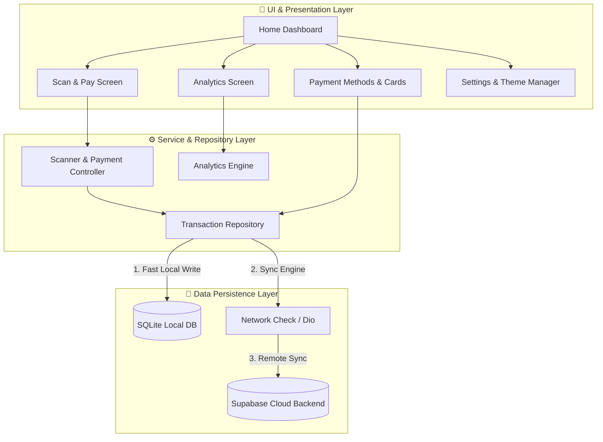

# 💳 HulyPay — Next-Gen Intelligent Fintech App

<p align="center">
  
</p>

<p align="center">
  <b>A sleek, offline-first mobile payment and financial intelligence platform built with Flutter, SQLite, and Supabase.</b>
</p>

<p align="center">
  <a href="#-quick-download--installation">Download APK</a> •
  <a href="#-phase-1-quickstart--running-the-app">Run App</a> •
  <a href="#-phase-2-features--tech-stack">Features & Tools</a> •
  <a href="#-phase-3-architecture--workflows">Workflows & Diagrams</a>
</p>

---

## 📥 Quick Download & Installation

> **Note for Android users:** When installing from your device file manager or browser, make sure to allow **"Install from unknown sources"** in your device security settings.

---

## 🚀 Phase 1: Quickstart — Download & Run the App

Follow these steps to clone, configure, and launch the application on Android, iOS, or physical devices.

### 1. Prerequisites

Ensure you have the following installed on your machine:

- [Flutter SDK](https://docs.flutter.dev/get-started/install) (version `^3.13.3` or later)
- [Dart SDK](https://dart.dev/get-dart) (included with Flutter)
- **Android:** Android Studio, Android SDK (API 21+), and an Emulator or physical Android device with USB debugging enabled
- **iOS (macOS only):** Xcode 14+, CocoaPods, and an iOS Simulator or connected iPhone

Verify your setup:

```bash
flutter doctor
```

### 2. Clone Repository & Setup

```bash
# Clone the repository
git clone https://github.com/Lovedragn/Huly-Pay.git

# Navigate into the mobile project root
cd Huly-Pay/mobile

# Install Dart & Flutter dependencies
flutter pub get
```

### 3. Environment Configuration

Create a `.env` file in the `mobile/` root directory (refer to `.env.example` or configure your Supabase credentials):

```env
SUPABASE_URL=https://your-project.supabase.co
SUPABASE_PUBLISHABLE_KEY=your-publishable-key-here
```

### 4. Run on Android

```bash
# List available devices/emulators
flutter devices

# Run directly on your connected Android device / emulator
flutter run

# To build a fresh release APK:
flutter build apk --release
# Output will be located in: build/app/outputs/flutter-apk/app-release.apk
```

### 5. Run on iOS (macOS required)

```bash
# Install iOS CocoaPods dependencies
cd ios
pod install
cd ..

# Run on iOS Simulator or connected device
flutter run -d ios

# Or open in Xcode for provisioning and signing:
open ios/Runner.xcworkspace
```

---

## 🛠️ Phase 2: Features & Tech Stack

### Core Features

- **⚡ Real-Time Scan & Pay:**
  - Ultra-responsive QR code scanner powered by `mobile_scanner`.
  - Support for camera flash toggle, camera flips, barcode decoding, and simulated sandbox QR payloads for test environments.
- **📊 Spending Insights & Analytics:**
  - Multi-theme interactive donut & bar charts utilizing `fl_chart`.
  - Temporal expense matrix, category breakdowns, and weekly/monthly trends.
- **💾 Offline-First Architecture:**
  - Local caching and rapid offline transaction reads/writes using `sqflite`.
  - Automatic sync engine syncing queued offline records with cloud backends when online.
- **🎨 Adaptive Theme & Dynamic Customization:**
  - Instant, flicker-free light and dark mode switching with persistent local state.
  - Custom theme palette support and glassmorphic UI components.
- **🔒 Biometrics & Security:**
  - Token validation, session handling, and configurable payment authentication controls.
- **💳 Multi-Method Payment Management:**
  - Virtual card cards, bank linking, and simulated payment gateways.

---

### Tech Stack & Tools

| Category               | Technology / Library                                                                                                   | Purpose                                             |
| :--------------------- | :--------------------------------------------------------------------------------------------------------------------- | :-------------------------------------------------- |
| **Framework**          | [Flutter](https://flutter.dev/) & [Dart](https://dart.dev/)                                                            | Cross-platform native mobile application            |
| **Backend & Auth**     | [Supabase](https://supabase.com/) (`supabase_flutter`)                                                                 | Cloud auth, user data storage, and backend sync     |
| **Local Database**     | [SQLite](https://sqlite.org/) (`sqflite`)                                                                              | Offline-first transaction persistence & caching     |
| **Networking**         | [Dio](https://pub.dev/packages/dio)                                                                                    | RESTful API client and HTTP request interceptors    |
| **Scanner & Camera**   | [mobile_scanner](https://pub.dev/packages/mobile_scanner)                                                              | High-performance native camera QR code scanning     |
| **Data Visualization** | [fl_chart](https://pub.dev/packages/fl_chart)                                                                          | Dynamic financial spending graphs & pie charts      |
| **Location & Maps**    | [google_maps_flutter](https://pub.dev/packages/google_maps_flutter), [geolocator](https://pub.dev/packages/geolocator) | Merchant geolocation and nearby ATM/store discovery |

---

## 📐 Phase 3: Architecture, Workflows & Diagrams

### System Architecture Overview



---

### Scan & Pay Transaction Workflow

```mermaid
sequenceDiagram
    autonumber
    actor User as 👤 User
    participant Scanner as 📷 Scan & Pay Screen
    participant Validator as 🛡️ Token Validator
    participant Repo as 💾 Transaction Repo
    participant SQLite as 📁 Local SQLite DB
    participant Cloud as ☁️ Supabase Cloud

    User->>Scanner: Opens Camera & Scans QR
    Scanner->>Validator: Decode payload & validate merchant/amount
    Validator-->>Scanner: QR Verified
    User->>Scanner: Confirms Payment (PIN / Biometric)
    Scanner->>Repo: Initiate Transaction
    Repo->>SQLite: Insert record (Status: Confirmed, Synced: Pending)
    Repo-->>Scanner: Return Immediate Success
    Scanner-->>User: Display Payment Confirmation Screen
    rect rgb(30, 40, 55)
    Note over Repo,Cloud: Background Sync Execution
    Repo->>Cloud: Push transaction record to remote DB
    Cloud-->>Repo: Acknowledge & update synced status
    Repo->>SQLite: Mark Synced = true
    end
```



---

### Folder Structure

```text
mobile/
├── mobile/hulypay/assets/              # Image mobile/hulypay/assets, brand logos, custom icons
├── android/              # Native Android configuration & Gradle files
├── ios/                  # Native iOS Xcode workspace & Podfiles
├── lib/
│   ├── main.dart         # App entrypoint & theme binding
│   ├── models/           # Data models (Transaction, User, Card, Category)
│   ├── repositories/     # Data abstraction layer (Transaction repository)
│   ├── screens/          # Application views (Dashboard, Scanner, Analytics, etc.)
│   ├── services/         # Services (Auth, SQLite DB, Preferences, Sync)
│   ├── theme/            # Design tokens, color palettes, typography
│   └── widgets/          # Reusable UI widgets and custom buttons
├── Release/
│   └── Hulypay.apk       # Direct installable test APK
├── pubspec.yaml          # Project dependencies and asset definitions
└── README.md             # Project documentation
```

---

## 👨‍💻 Developer & Contributing

Created & maintained by **Sujith Sappani** ([sujithsappani.vercel.app](https://sujithsappani.vercel.app)).

1. Fork the Project
2. Create your Feature Branch (`git checkout -b feature/AmazingFeature`)
3. Commit your Changes (`git commit -m 'Add some AmazingFeature'`)
4. Push to the Branch (`git push origin feature/AmazingFeature`)
5. Open a Pull Request

---

## 📄 License

This project is for demonstration and development purposes. Check [LICENSE](LICENSE) for more details.
