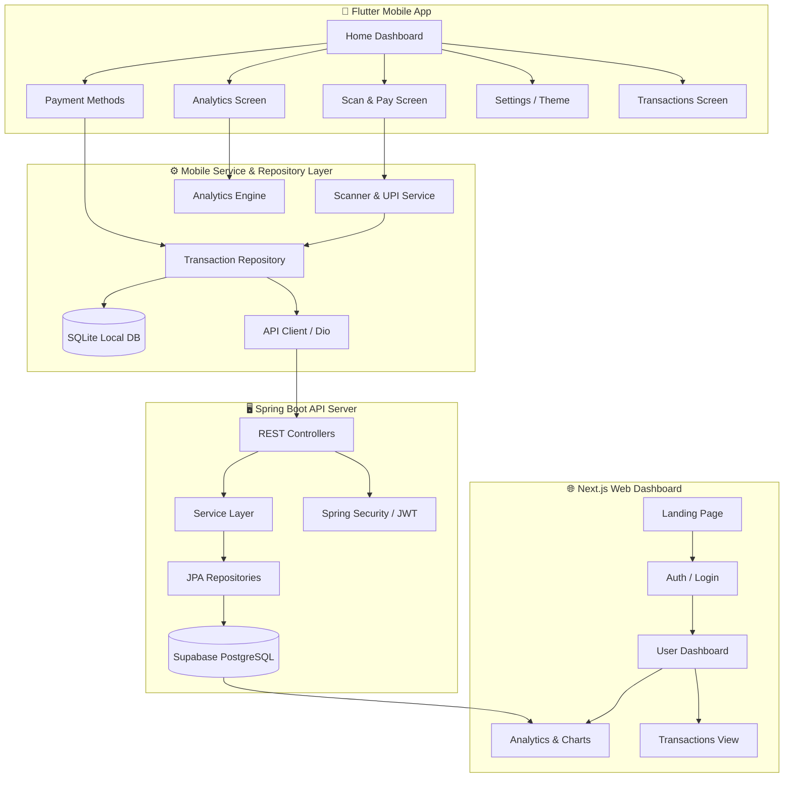
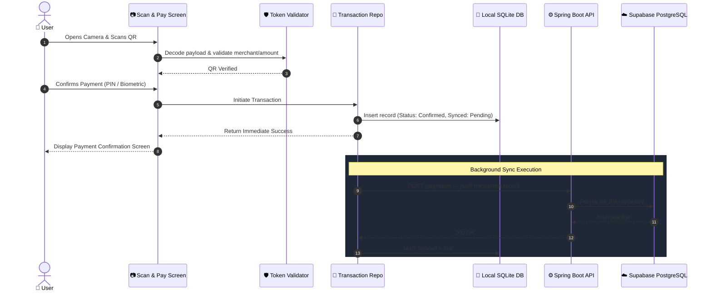
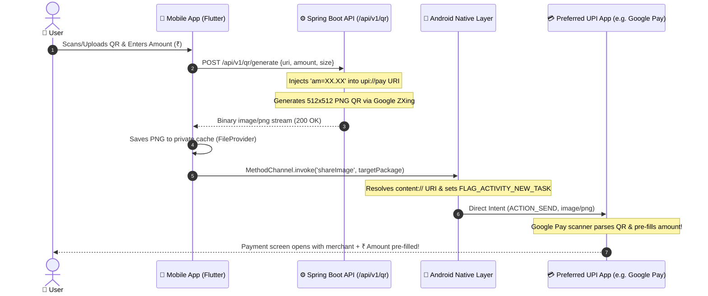

# 💳 HulyPay — Next-Gen Intelligent Fintech Platform

<p align="center">
  
</p>

<p align="center">
  <b>A full-stack, offline-first mobile payment & financial intelligence platform — built with Flutter, Spring Boot, Next.js, and Supabase.</b>
</p>

<p align="center">
  <a href="#-quick-download--installation">Download APK</a> •
  <a href="RELEASE_v3.0.0.md">Release Notes (v3.0.0)</a> •
  <a href="#-phase-1-quickstart--running-the-mobile-app">Run Mobile App</a> •
  <a href="#️-phase-2-backend--api-server-spring-boot">Backend Setup</a> •
  <a href="#-phase-3-frontend--web-dashboard-nextjs">Web Dashboard</a> •
  <a href="#️-phase-4-features--tech-stack">Features & Tech Stack</a> •
  <a href="#-phase-5-architecture-workflows--diagrams">Architecture & Diagrams</a>
</p>

---

## 📥 Quick Download & Installation

> **Note for Android users:** When installing from your device file manager or browser, make sure to allow **"Install from unknown sources"** in your device security settings.

The latest release APK is available at `mobile/hulypay/Release/Hulypay.apk` (Version `v3.0.0` with Faster Upload & Direct Gateway Dispatch). Check out [RELEASE_v3.0.0.md](RELEASE_v3.0.0.md) for full architectural specifications.

---

## 🚀 Phase 1: Quickstart — Running the Mobile App

Follow these steps to clone, configure, and launch the Flutter application on Android or iOS.

### 1. Prerequisites

Ensure you have the following installed on your machine:

- [Flutter SDK](https://docs.flutter.dev/get-started/install) (version `^3.13.3` or later)
- [Dart SDK](https://dart.dev/get-dart) (included with Flutter)
- **Android:** Android Studio, Android SDK (API 21+), and an Emulator or physical Android device with USB debugging enabled
- **iOS (macOS only):** Xcode 14+, CocoaPods, and an iOS Simulator or connected iPhone

Verify your setup:

```bash
flutter doctor
```

### 2. Clone Repository & Setup

```bash
# Clone the repository
git clone https://github.com/Lovedragn/Huly-Pay.git

# Navigate into the mobile project directory
cd Huly-Pay/mobile/hulypay

# Install Flutter dependencies
flutter pub get
```

### 3. Environment Configuration

Create a `.env` file in the `mobile/hulypay/` directory:

```env
SUPABASE_URL=https://your-project.supabase.co
SUPABASE_PUBLISHABLE_KEY=your-publishable-key-here
```

### 4. Run on Android

```bash
# List available devices/emulators
flutter devices

# Run on your connected Android device / emulator
flutter run

# Build a release APK
flutter build apk --release
# Output: build/app/outputs/flutter-apk/app-release.apk
```

### 5. Run on iOS (macOS required)

```bash
# Install CocoaPods dependencies
cd ios && pod install && cd ..

# Run on iOS Simulator or connected device
flutter run -d ios

# Or open in Xcode for provisioning and signing:
open ios/Runner.xcworkspace
```

---

## ⚙️ Phase 2: Backend — API Server (Spring Boot)

The backend is a **Spring Boot 4** REST API with Spring Security, JPA, and PostgreSQL (via Supabase), deployable via Docker.

### Prerequisites

- Java 21+
- Maven (or use the included `mvnw` wrapper)
- PostgreSQL database (Supabase recommended)
- Docker (optional, for containerised deployment)

### Setup & Run Locally

```bash
# Navigate to the backend directory
cd Huly-Pay/backend

# Configure required environment variables:
# SUPABASE_DB_URL, SUPABASE_DB_USERNAME, SUPABASE_DB_PASSWORD
# SUPABASE_URL, SUPABASE_PUBLISHABLE_KEY
# GOOGLE_OAUTH_SECRET_ID_WEB, GITHUB_SECRET_ID

# Run with Maven wrapper
./mvnw spring-boot:run

# Or build and run the JAR directly
./mvnw clean package -DskipTests
java -jar target/backend-0.0.1-SNAPSHOT.jar
```

### Docker Deployment

```bash
docker build -t hulypay-backend .
docker compose up -d
```

- API base URL: `http://localhost:8080`
- Swagger UI: `http://localhost:8080/swagger-ui.html`
- Health check: `GET /actuator/health`

---

## 🌐 Phase 3: Frontend — Web Dashboard (Next.js)

The frontend is a **Next.js 16** web application with Tailwind CSS, GSAP animations, and Supabase authentication.

### Prerequisites

- Node.js 18+ and npm

### Setup & Run Locally

```bash
# Navigate to the frontend directory
cd Huly-Pay/frontend

# Install dependencies
npm install

# Configure environment variables
# Set NEXT_PUBLIC_SUPABASE_URL, NEXT_PUBLIC_SUPABASE_ANON_KEY, etc. in .env.local

# Start the development server
npm run dev
```

The web app will be available at `http://localhost:3000`.

### Build for Production

```bash
npm run build && npm start
```

---

## 🛠️ Phase 4: Features & Tech Stack

### Core Features

- **⚡ Real-Time Scan & Pay & Faster Upload Gateway (v3.0.0):**
  - Ultra-responsive QR code scanner powered by `mobile_scanner`.
  - **Dynamic Amount-Injected QR Gateway**: Automatically sends scanned UPI URIs and entered amounts to the Spring Boot backend (`/api/v1/qr/generate`), generating crisp amount-prefilled QR codes in real-time.
  - **Zero-Friction Direct-to-App Gateway Dispatch**: Bypasses the clunky Android system Sharesheet to launch directly into Google Pay (or the user's preferred UPI app from settings) with full payload parameters (`am`, `pa`, `pn`) pre-filled!
  - Camera flash toggle, camera flips, barcode decoding, and sandbox QR payloads for test environments.
  - QR gallery import & upload flow via `qr_share_service`.
- **📊 Spending Insights & Analytics:**
  - Multi-theme interactive donut & bar charts using `fl_chart`.
  - Temporal spending heatmap, category breakdowns, weekly/monthly bar charts, and trend line charts.
  - Analytics powered by a dedicated Spring Boot analytics module.
- **💾 Offline-First Architecture:**
  - Local caching and rapid offline transaction reads/writes using `sqflite`.
  - Automatic background sync engine queuing offline records and pushing them to the cloud backend when online.
- **🎨 Adaptive Theme & Dynamic Customization:**
  - Instant, flicker-free light and dark mode switching with persistent local state via `user_preferences_service`.
  - Custom theme palette support, glassmorphic UI components, and a customization bottom sheet.
- **🔒 Biometrics & Security:**
  - Spring Security + OAuth2 Resource Server for JWT validation.
  - Token validation, session handling, and configurable payment authentication controls.
  - Google OAuth & GitHub OAuth support.
- **💳 Multi-Method Payment Management:**
  - UPI payment integration (`upi_payment_service`, `upi_service`).
  - Google Pay service integration.
  - Virtual cards, bank linking, and payment methods screen.
- **📍 Location & Merchant Discovery:**
  - GPS-based location service with `google_maps_flutter` and `geolocator`.
  - Nearby ATM/store discovery on the map.
- **📱 SMS Transaction Parsing:**
  - SMS filter service for automatic bank SMS transaction detection.
- **🌐 Web Dashboard:**
  - Next.js admin and user dashboard with GSAP-powered animations and smooth scroll (Lenis).
  - Full authentication flow, transaction views, analytics charts via Recharts, and Q&A / help pages.

---

### Tech Stack

#### 📱 Mobile (Flutter)

| Category               | Technology / Library                                                                                                   | Purpose                                              |
| :--------------------- | :--------------------------------------------------------------------------------------------------------------------- | :--------------------------------------------------- |
| **Framework**          | [Flutter](https://flutter.dev/) & [Dart](https://dart.dev/)                                                            | Cross-platform native mobile application             |
| **Backend & Auth**     | [Supabase](https://supabase.com/) (`supabase_flutter`)                                                                 | Cloud auth, user data storage, and backend sync      |
| **Local Database**     | [SQLite](https://sqlite.org/) (`sqflite`)                                                                              | Offline-first transaction persistence & caching      |
| **Networking**         | [Dio](https://pub.dev/packages/dio)                                                                                    | RESTful API client and HTTP request interceptors     |
| **Scanner & Camera**   | [mobile_scanner](https://pub.dev/packages/mobile_scanner)                                                              | High-performance native camera QR code scanning      |
| **Data Visualization** | [fl_chart](https://pub.dev/packages/fl_chart)                                                                          | Dynamic financial spending graphs & pie charts       |
| **Location & Maps**    | [google_maps_flutter](https://pub.dev/packages/google_maps_flutter), [geolocator](https://pub.dev/packages/geolocator) | Merchant geolocation and nearby ATM/store discovery  |
| **Payments**           | `upi_india`, `pay`                                                                                                     | UPI & Google Pay payment integration                 |

#### ⚙️ Backend (Spring Boot)

| Category             | Technology                                                                       | Purpose                                       |
| :------------------- | :------------------------------------------------------------------------------- | :-------------------------------------------- |
| **Framework**        | [Spring Boot 4](https://spring.io/projects/spring-boot) (Java 21)                | REST API server                               |
| **Security**         | Spring Security + OAuth2 Resource Server                                         | JWT auth, Google & GitHub OAuth               |
| **Database**         | [PostgreSQL](https://www.postgresql.org/) via [Supabase](https://supabase.com/)  | Persistent relational data store              |
| **ORM**              | Spring Data JPA + Hibernate                                                      | Data access layer                             |
| **Validation**       | Spring Boot Validation (`jakarta.validation`)                                    | Request body validation                       |
| **API Docs**         | [SpringDoc OpenAPI](https://springdoc.org/) (Swagger UI)                         | Auto-generated REST API documentation         |
| **Containerisation** | Docker + Docker Compose                                                          | Containerised local & cloud deployment        |
| **Cloud Deploy**     | [Render](https://render.com/) (Singapore region)                                 | Hosted backend via `render.yaml` blueprint    |

#### 🌐 Frontend (Next.js)

| Category       | Technology                                                                   | Purpose                              |
| :------------- | :--------------------------------------------------------------------------- | :----------------------------------- |
| **Framework**  | [Next.js 16](https://nextjs.org/) + [React 19](https://react.dev/)          | Server-side rendered web application |
| **Styling**    | [Tailwind CSS 4](https://tailwindcss.com/)                                   | Utility-first CSS framework          |
| **Animations** | [GSAP](https://gsap.com/) + [Lenis](https://lenis.darkroom.engineering/)     | Scroll-driven & micro animations     |
| **Charts**     | [Recharts](https://recharts.org/)                                            | Analytics data visualisation         |
| **Auth**       | [Supabase JS](https://supabase.com/docs/reference/javascript/)               | Authentication & data queries        |
| **Icons**      | [Lucide React](https://lucide.dev/)                                          | Icon library                         |

---

## 📐 Phase 5: Architecture, Workflows & Diagrams

### System Architecture Overview


```mermaid
graph TD
    subgraph Mobile ["📱 Flutter Mobile App"]
        A[Home Dashboard] --> B[Scan & Pay Screen]
        A --> C[Analytics Screen]
        A --> D[Payment Methods]
        A --> E[Settings / Theme]
        A --> F[Transactions Screen]
    end

    subgraph Services ["⚙️ Mobile Service & Repository Layer"]
        B --> G[Scanner & UPI Service]
        C --> H[Analytics Engine]
        G --> I[Transaction Repository]
        D --> I
        I --> J[(SQLite Local DB)]
        I --> K[API Client / Dio]
    end

    subgraph Backend ["🖥️ Spring Boot API Server"]
        K --> L[REST Controllers]
        L --> M[Service Layer]
        M --> N[JPA Repositories]
        N --> O[(Supabase PostgreSQL)]
        L --> P[Spring Security / JWT]
    end

    subgraph Web ["🌐 Next.js Web Dashboard"]
        Q[Landing Page] --> R[Auth / Login]
        R --> S[User Dashboard]
        S --> T[Analytics & Charts]
        S --> U[Transactions View]
    end

    O --> T
```

---

### Scan & Pay Transaction Workflow


```mermaid
sequenceDiagram
    autonumber
    actor User as 👤 User
    participant Scanner as 📷 Scan & Pay Screen
    participant Validator as 🛡️ Token Validator
    participant Repo as 💾 Transaction Repo
    participant SQLite as 📁 Local SQLite DB
    participant API as ⚙️ Spring Boot API
    participant Cloud as ☁️ Supabase PostgreSQL

    User->>Scanner: Opens Camera & Scans QR
    Scanner->>Validator: Decode payload & validate merchant/amount
    Validator-->>Scanner: QR Verified
    User->>Scanner: Confirms Payment (PIN / Biometric)
    Scanner->>Repo: Initiate Transaction
    Repo->>SQLite: Insert record (Status: Confirmed, Synced: Pending)
    Repo-->>Scanner: Return Immediate Success
    Scanner-->>User: Display Payment Confirmation Screen
    rect rgb(30, 40, 55)
    Note over Repo,Cloud: Background Sync Execution
    Repo->>API: POST /payments — push transaction record
    API->>Cloud: Persist via JPA repository
    Cloud-->>API: Acknowledge
    API-->>Repo: 200 OK
    Repo->>SQLite: Mark Synced = true
    end
```

---

### Dynamic Amount-Injected QR & Direct Dispatch Workflow (v3.0.0)


```mermaid
sequenceDiagram
    autonumber
    actor User as 👤 User
    participant App as 📱 Mobile App (Flutter)
    participant Backend as ⚙️ Spring Boot API (/api/v1/qr)
    participant Native as 🤖 Android Native Layer
    participant UPI as 💳 Preferred UPI App (e.g. Google Pay)

    User->>App: Scans/Uploads QR & Enters Amount (₹)
    App->>Backend: POST /api/v1/qr/generate {uri, amount, size}
    Note over Backend: Injects 'am=XX.XX' into upi://pay URI
    Note over Backend: Generates 512x512 PNG QR via Google ZXing
    Backend-->>App: Binary image/png stream (200 OK)
    App->>App: Saves PNG to private cache (FileProvider)
    App->>Native: MethodChannel.invoke('shareImage', targetPackage)
    Note over Native: Resolves content:// URI & sets FLAG_ACTIVITY_NEW_TASK
    Native->>UPI: Direct Intent (ACTION_SEND, image/png)
    Note over UPI: Google Pay scanner parses QR & pre-fills amount!
    UPI-->>User: Payment screen opens with merchant + ₹ Amount pre-filled!
```

---

### Folder Structure

```text
Huly-Pay/
├── mobile/
│   └── hulypay/
│       ├── assets/               # Images, logos, custom icons
│       ├── android/              # Native Android Gradle config
│       ├── ios/                  # Native iOS Xcode workspace & Podfile
│       ├── Release/
│       │   └── Hulypay.apk       # Latest installable release APK
│       ├── lib/
│       │   ├── main.dart         # App entrypoint & theme binding
│       │   ├── data/             # Local data sources
│       │   ├── models/           # Data models (Transaction, User, Card, Category, Expense)
│       │   ├── repositories/     # Data abstraction layer
│       │   ├── screens/          # App views:
│       │   │   ├── home_dashboard_screen.dart
│       │   │   ├── scan_and_pay_screen.dart
│       │   │   ├── scan_amount_screen.dart
│       │   │   ├── upload_qr_screen.dart
│       │   │   ├── analysis_screen.dart
│       │   │   ├── transactions_screen.dart
│       │   │   ├── single_transaction_screen.dart
│       │   │   ├── payment_methods_screen.dart
│       │   │   ├── settings_screen.dart
│       │   │   ├── notifications_screen.dart
│       │   │   ├── privacy_security_screen.dart
│       │   │   ├── help_support_screen.dart
│       │   │   ├── about_hulypay_screen.dart
│       │   │   ├── sign_in_screen.dart
│       │   │   └── splash_screen.dart
│       │   ├── services/         # Business logic services:
│       │   │   ├── api_client.dart
│       │   │   ├── auth_service.dart
│       │   │   ├── google_pay_service.dart
│       │   │   ├── local_database_service.dart
│       │   │   ├── location_service.dart
│       │   │   ├── qr_share_service.dart
│       │   │   ├── sms_filter_service.dart
│       │   │   ├── token_validator.dart
│       │   │   ├── upi_payment_service.dart
│       │   │   ├── upi_service.dart
│       │   │   └── user_preferences_service.dart
│       │   ├── theme/            # Design tokens, color palettes, typography
│       │   └── widgets/          # Reusable UI components:
│       │       ├── analysis_category_pie_chart.dart
│       │       ├── category_picker_sheet.dart
│       │       ├── custom_bottom_nav_bar.dart
│       │       ├── customization_bottom_sheet.dart
│       │       ├── home_spend_trend_line_chart.dart
│       │       ├── home_today_spend_gauge.dart
│       │       ├── home_weekly_bar_chart.dart
│       │       ├── spending_heatmap.dart
│       │       ├── transaction_detail_components.dart
│       │       └── transaction_tile.dart
│       └── pubspec.yaml
│
├── backend/                      # Spring Boot 4 REST API (Java 21)
│   ├── src/main/java/com/hulypay/backend/
│   │   ├── analytics/            # Analytics endpoints & service
│   │   ├── categories/           # Category management
│   │   ├── common/               # Shared utilities & base classes
│   │   ├── config/               # Security, CORS, JWT, Swagger config
│   │   ├── expenses/             # Expense CRUD
│   │   ├── payments/             # Payment processing
│   │   └── users/                # User registration & profile
│   ├── Dockerfile
│   ├── docker-compose.yml
│   ├── pom.xml
│   └── render.yaml
│
├── frontend/                     # Next.js 16 Web Dashboard
│   ├── src/
│   │   ├── app/                  # Next.js App Router pages:
│   │   │   ├── dashboard/        # User dashboard
│   │   │   ├── design/           # Design system showcase
│   │   │   ├── features/         # Features page
│   │   │   ├── login/            # Auth flow
│   │   │   ├── privacy-terms/    # Legal pages
│   │   │   ├── qna/              # Q&A / Help
│   │   │   └── tools/            # Financial tools
│   │   ├── components/           # Reusable React components:
│   │   │   ├── landing/          # Landing page sections
│   │   │   ├── dashboard/        # Dashboard-specific components
│   │   │   ├── common/           # Shared UI components
│   │   │   ├── ui/               # Primitive UI elements
│   │   │   └── transitions/      # Page transition components
│   │   ├── context/              # React context providers
│   │   └── lib/                  # Utilities & Supabase client
│   ├── Dockerfile
│   └── package.json
│
├── render.yaml                   # Render deployment blueprint
└── README.md
```

---

## 👨‍💻 Developer & Contributing

Created & maintained by **Sujith Sappani** ([sujithsappani.vercel.app](https://sujithsappani.vercel.app)).

1. Fork the Project
2. Create your Feature Branch (`git checkout -b feature/AmazingFeature`)
3. Commit your Changes (`git commit -m 'Add some AmazingFeature'`)
4. Push to the Branch (`git push origin feature/AmazingFeature`)
5. Open a Pull Request

---

## 📄 License

This project is for demonstration and development purposes. Check [LICENSE](LICENSE) for more details.

