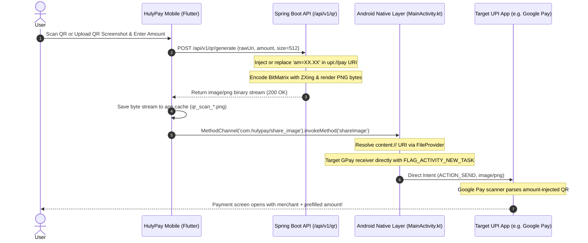

# 🚀 Release v3.0.0 — Faster Upload Gateway & Dynamic QR Injection

> **Release Tag**: `v3.0.0`  
> **Headline**: Direct-to-App UPI Dispatch & Server-Side Amount-Injected QR Code Generation

---

## 🌟 New Features & Capabilities

### 1. ⚡ Direct-to-App Gateway Dispatch (Zero Sharesheet Interruption)
- **Problem Solved**: Previously, sharing scanned or uploaded QR codes triggered the generic Android system Sharesheet / Chooser modal. This required extra taps and often resulted in the external payment app opening on a blank dashboard without prefilling payment details.
- **New Behavior**: 
  - HulyPay automatically detects the user's default payment app preference (Google Pay, PhonePe, Paytm, Amazon Pay, BHIM).
  - QR codes are routed directly to the recipient app’s payment intent filter (e.g. `com.google.android.apps.nbu.paisa.user/com.google.nbu.paisa.flutter.gpay.app.ShareIntentFilter`) with `FLAG_ACTIVITY_NEW_TASK` and `FLAG_GRANT_READ_URI_PERMISSION`.
  - **No Sharesheet modal appears** — the transaction launches seamlessly straight into the payment application.

### 2. 🎯 Dynamic Amount Injection (`am=...`) via Backend QR Gateway
- **Problem Solved**: Static QR codes uploaded or scanned from merchants do not contain the amount a user wants to pay. When importing an image screenshot to Google Pay, the amount field remained blank.
- **New Behavior**:
  - The Flutter client sends the scanned raw UPI URI and user-entered amount to the backend: `POST /api/v1/qr/generate`.
  - The Spring Boot backend dynamically inspects, replaces, or injects the `am=XX.XX` query parameter into the UPI specification string.
  - The backend generates a crisp 512x512 PNG QR code in-memory using Google ZXing with error correction level `M` and sends the binary image stream directly back to Flutter.
  - The freshly minted QR image is passed to Google Pay, causing Google Pay’s scanner to **prefill both the merchant payee details and the exact amount**!

### 3. 🛡️ Native FileProvider & Content URI Stream Isolation
- Generated QR code byte streams are securely written to private application cache (`qr_scan_<timestamp>.png` / `qr_generated_<timestamp>.png`).
- Shareable URIs are resolved via Android `FileProvider` (`content://com.hulypay.app.fileprovider/...`) with explicit temporary read/write grant permissions, preventing `FileUriExposedException` across all Android versions (API 21 through API 35).

---

## 🏛️ Architectural Changes

### High-Level Architecture Flow



---

## 📂 Key Codebase Modifications

| Module | File | Key Change |
|---|---|---|
| **Backend** | [`QrCodeController.java`](file:///d:/Coding/Flutter/Huly.pay/backend/src/main/java/com/hulypay/backend/Controllers/QrCodeController.java) | Added POST & GET endpoints at `/api/v1/qr/generate` accepting `uri` and `amount`, injecting `am`, and returning `image/png`. |
| **Android Native** | [`MainActivity.kt`](file:///d:/Coding/Flutter/Huly.pay/mobile/hulypay/android/app/src/main/kotlin/com/hulypay/app/MainActivity.kt) | Bypassed `Intent.createChooser` when target package is present; added `FLAG_ACTIVITY_NEW_TASK` and URI grant flags. |
| **Flutter Service** | [`ApiClient.dart`](file:///d:/Coding/Flutter/Huly.pay/mobile/hulypay/lib/services/api_client.dart) | Added `generateQrCode()` with `ResponseType.bytes` and `Accept: image/png` headers. |
| **Flutter Service** | [`QrShareService.dart`](file:///d:/Coding/Flutter/Huly.pay/mobile/hulypay/lib/services/qr_share_service.dart) | Defaulted `targetPackage` to `googlePayPackage` to ensure direct dispatch without Android sharesheet popup. |
| **Flutter UI** | [`ScanAndPayScreen.dart`](file:///d:/Coding/Flutter/Huly.pay/mobile/hulypay/lib/screens/scan_and_pay_screen.dart) | Wired backend QR amount injection flow on scan confirmation; resolved target package from user preferences. |
| **Flutter UI** | [`UploadQrScreen.dart`](file:///d:/Coding/Flutter/Huly.pay/mobile/hulypay/lib/screens/upload_qr_screen.dart) | Implemented backend amount injection & direct payment gateway dispatch for gallery QR screenshots. |

---

## ⚙️ Setup & Verification

1. **Verify Backend Reverse Port (For Local Dev)**:
   ```bash
   adb reverse tcp:8080 tcp:8080
   ```
2. **Environment Variable Configuration**:
   ```env
   # mobile/hulypay/.env
   API_BASE_URL=http://127.0.0.1:8080
   ```
3. **Run Application**:
   ```bash
   flutter run --release
   ```
