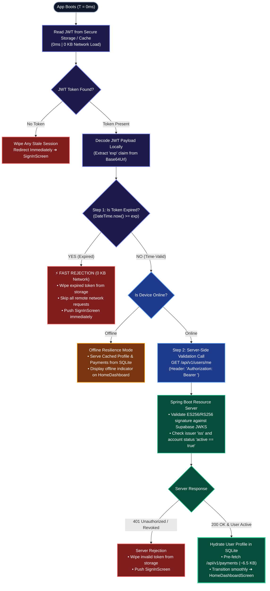

# HulyPay — Startup Network Load & Two-Step Validation Architecture

This document details the **Two-Step Authentication Validation Pipeline** and **Startup Network Load Profile** executed as soon as the HulyPay application boots (T = 0ms up to Splash Screen transition).

---

## 1. Core Architecture: Two-Step Validation Strategy

To prevent sluggish startup times and eliminate unnecessary network round-trips, HulyPay executes a **Two-Step Validation Process**:

```
┌────────────────────────────────────────────────────────────────────────────────────────┐
│ STEP 1: CLIENT-SIDE CHECK (FAST & ZERO-NETWORK)                                        │
│ • Reads JWT directly from local storage / cache.                                       │
│ • Decodes the payload in memory without calling any remote server (0 KB Network Load). │
│ • Evaluates: DateTime.now() > exp timestamp.                                           │
│                                                                                        │
│ ❌ IF EXPIRED: Immediately wipe the token, abort remote calls, and redirect to login.  │
│ ✅ IF VALID:   Proceed to Step 2.                                                      │
└───────────────────────────────────────────┬────────────────────────────────────────────┘
                                            │ Token is time-valid
                                            ▼
┌────────────────────────────────────────────────────────────────────────────────────────┐
│ STEP 2: SERVER-SIDE VALIDATION (SECURE & AUTHORITATIVE)                                │
│ • Makes an initial API request: GET /api/v1/users/me (Authorization: Bearer <JWT>).   │
│ • Spring Boot verifies the cryptographic ES256/RS256 signature using Supabase JWKS.    │
│ • Ensures the account is active: true, not suspended, and token is not revoked.       │
│                                                                                        │
│ ❌ IF 401 / REVOKED: Wipe token and redirect to login screen.                         │
│ ✅ IF 200 OK ACTIVE: Hydrate dashboard, pre-fetch transactions, and transition home.   │
└────────────────────────────────────────────────────────────────────────────────────────┘
```

---

## 2. Two-Step Startup Flowchart



---

## 3. Sequence Diagram: Step 1 (Local) vs Step 2 (Server)

```mermaid
sequenceDiagram
    autonumber
    actor User
    participant App as Mobile App (SplashScreen)
    participant Storage as Local Secure Storage / SQLite
    participant Backend as Spring Boot API (/api/v1/users/me)
    participant Supabase as Supabase JWKS Endpoint

    User->>App: Tap App Icon (Cold Boot T = 0ms)
    App->>App: Mount SplashScreen on Frame 0

    %% STEP 1: CLIENT-SIDE CHECK
    rect rgb(25, 25, 45)
        Note over App, Storage: STEP 1: Client-Side Check (Fast & Zero-Network)
        App->>Storage: Read stored JWT token
        Storage-->>App: Return JWT string (header.payload.signature)
        App->>App: Decode payload: base64Url(payload) ➔ json['exp']
        alt Token Expired (now >= exp)
            App->>Storage: Wipe expired token and cached user
            App->>User: Push Transition ➔ SignInScreen (0ms network delay)
        else Token Time-Valid (now < exp)
            Note over App: Token passed Step 1. Proceed to Step 2.
        end
    end

    %% STEP 2: SERVER-SIDE VALIDATION
    rect rgb(20, 45, 35)
        Note over App, Backend: STEP 2: Server-Side Validation (Secure & Authoritative)
        App->>Backend: GET /api/v1/users/me (Authorization: Bearer <JWT>)
        activate Backend
        Backend->>Supabase: Verify signature via JWKS (ES256/RS256)
        Supabase-->>Backend: Signature Verified
        Backend->>Backend: Check user active == true in PostgreSQL
        alt User Active & Valid
            Backend-->>App: 200 OK (UserProfile JSON)
            App->>Storage: Cache fresh profile
            App->>Backend: GET /api/v1/payments (Pre-fetch transactions)
            Backend-->>App: 200 OK (Payments JSON array)
            App->>User: Splash timer finishes ➔ Push HomeDashboardScreen
        else User Banned / Revoked / Token Invalid
            Backend-->>App: 401 Unauthorized
            App->>Storage: Wipe stored token
            App->>User: Push Transition ➔ SignInScreen
        end
        deactivate Backend
    end
```



---

## 4. Startup Network Load Breakdown (With Two-Step Validation)

By placing **Step 1 (Client-Side Expiry Check)** before any network calls, expired sessions produce **0 KB of network traffic**:

### Scenario A: Expired Token (Preempted by Step 1)
| Request | Endpoint | Method | Outbound | Inbound | Latency | Result |
|---|---|---|---|---|---|---|
| *None* | *Client-Side Check Failed* | - | **0 B** | **0 B** | **< 1 ms** | **Immediately route to `SignInScreen`** |
| **TOTAL** | | | **0 B** | **0 B** | **< 1 ms** | **Saves 100% of network traffic & 500ms+ delay** |

---

### Scenario B: Valid Token (Step 1 Passes ➔ Step 2 Dispatched)
| # | Request Name | Endpoint & Method | Purpose | Est. Outbound | Est. Inbound | Target TTFB |
|---|---|---|---|---|---|---|
| **REQ-1** | **Server Auth & Profile** | `GET /api/v1/users/me` | Step 2 Server-Side Validation | ~520 B | ~980 B | < 220 ms |
| **REQ-2** | **Backend Health** | `GET /api/health` | Backend Liveness probe | ~320 B | ~180 B | < 120 ms |
| **REQ-3** | **Payments Prefetch** | `GET /api/v1/payments` | Preload dashboard data | ~480 B | ~6.50 KB | < 350 ms |
| **TOTAL** | | | | **~1.32 KB** | **~7.66 KB** | **~8.98 KB Total Load** |

---

## 5. Technical Implementation Details

### Step 1: Client-Side Decoder (Flutter / Dart)

Executes with zero third-party dependencies and zero network round-trips:

```dart
import 'dart:convert';

class TokenValidator {
  /// Step 1: Decode JWT and verify expiration locally (0ms, 0 KB Network)
  static bool isTokenExpiredLocally(String? token, {int bufferSeconds = 30}) {
    if (token == null || token.trim().isEmpty) return true;

    try {
      final parts = token.split('.');
      if (parts.length != 3) return true;

      // Base64Url decode payload
      final normalized = base64Url.normalize(parts[1]);
      final payloadString = utf8.decode(base64Url.decode(normalized));
      final Map<String, dynamic> payload = jsonDecode(payloadString);

      if (!payload.containsKey('exp')) return true;

      final expTimestamp = payload['exp'] as int;
      final expiryDate = DateTime.fromMillisecondsSinceEpoch(expTimestamp * 1000);

      // Add safety buffer (e.g. 30 seconds)
      final nowWithBuffer = DateTime.now().add(Duration(seconds: bufferSeconds));
      return nowWithBuffer.isAfter(expiryDate);
    } catch (_) {
      return true; // Malformed token is treated as expired
    }
  }
}
```

---

### Step 2: Server-Side Validation (Spring Boot `SecurityConfig.java`)

Enforces cryptographic signature check and verifies user account status:

```java
// Spring Boot Resource Server validates signature and issuer
@Bean
public SecurityFilterChain securityFilterChain(HttpSecurity http) throws Exception {
    http
        .authorizeHttpRequests(auth -> auth
            .requestMatchers(HttpMethod.GET, "/api/health").permitAll()
            .requestMatchers("/api/**").authenticated()
        )
        .oauth2ResourceServer(oauth2 -> oauth2.jwt(Customizer.withDefaults()));
    return http.build();
}

// Controller verifies active user state
@GetMapping("/api/v1/users/me")
public ResponseEntity<UserProfileDto> getCurrentUser(@AuthenticationPrincipal Jwt jwt) {
    String userId = jwt.getSubject();
    UserProfile user = userService.getById(userId);
    
    if (!user.isActive()) {
        throw new ResponseStatusException(HttpStatus.FORBIDDEN, "Account suspended");
    }
    return ResponseEntity.ok(UserProfileDto.from(user));
}
```

---

## 6. Summary Comparison Matrix

| Feature | Step 1: Client-Side Check | Step 2: Server-Side Validation |
|---|---|---|
| **Location** | Mobile App (Flutter) | Backend (Spring Boot + Supabase) |
| **Execution Timing** | Immediately on boot (`T = 0ms`) | Once Step 1 passes (`T ≈ 80ms`) |
| **Network Overhead** | **0 KB (Completely offline)** | **~1.5 KB (Single lightweight GET)** |
| **Verification Focus** | Timestamp expiration (`exp` claim) | ES256/RS256 Signature, User Active status |
| **Tamper Resistance** | Low (Client clock can drift/be modified) | High (Cryptographically signed by Supabase) |
| **Failure Response** | Instant local wipe ➔ `SignInScreen` | 401 Unauthorized ➔ Local wipe ➔ `SignInScreen` |
| **Primary Benefit** | **Speed & Bandwidth Elimination** | **Ironclad Security & Data Protection** |
